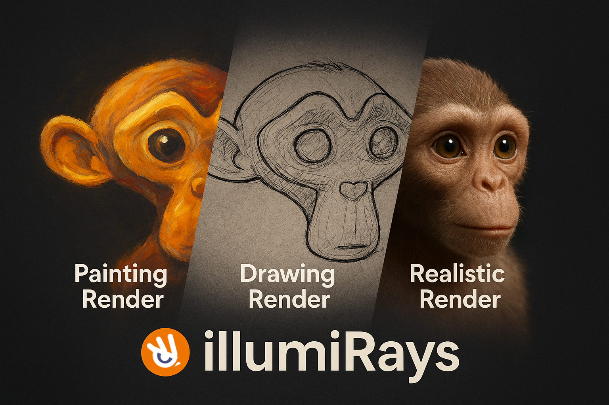

# IllumiRays — Blender Add-on 🌌  


[](LICENSE)


---

© 2025 **Vincent Ilagan**. All rights reserved.  

**IllumiRays** is a lightweight Blender add-on that allows you to quickly switch between different rendering styles (Cartoon, Painting, Watercolor, Hyper-Realism) and adjust lighting direction (Top, Right, Left, Sun) using a simple UI panel.  

It also supports optional **OpenCV-powered post-effects** such as *Watercolor Stylization, Pencil Sketch,* and *Edge Preserve filtering*.  

---

## ✨ Features
- 🎬 **One-Click Scene Setup** – Automatically creates floor, box, camera, world environment, and sun light.  
- 🎨 **Render Styles**  
  - 2D Cartoon (Toon Shader)  
  - Painting Style (Soft & Diffused)  
  - Watercolor Style (Matte look)  
  - Hyper Realism (Physically accurate with PBR)  
- 💡 **Lighting Control** – Quick slider for Top, Right, Left, or Sun lighting. Adjustable intensity.  
- 🔀 **Engine Switching** – Switch between Eevee and Cycles depending on style.  
- 🖌️ **OpenCV Integration (Optional)**  
  - Watercolor Stylization (`cv2.stylization`)  
  - Pencil Sketch (`cv2.pencilSketch`)  
  - Edge Preserving Filter (`cv2.edgePreservingFilter`)  
- ⚡ **Auto Render + Stylize** – Render to PNG and (optionally) process with OpenCV filters.  

---

## 📦 Requirements
- Blender **3.6+**  
- Python modules:  
  - `bpy` (built-in with Blender)  
  - `math`, `os`, `pathlib` (standard)  
  - `opencv-python` *(optional, for Post FX)*  
  - `numpy` *(bundled with Blender’s Python, required by OpenCV)*  

> ✅ No need to install `bpy` manually — it is bundled with Blender.  

---

## ⚙️ Installation Guide

### 1. Save the Add-on
Download or copy the script (`illumirays.py`) into a safe location.  

### 2. Install in Blender
1. Open Blender.  
2. Go to **Edit > Preferences > Add-ons**.  
3. Click **Install…**, then select `illumirays.py`.  
4. Enable the checkbox next to **IllumiRays**.  

### 3. Access the Panel
1. Open the **3D Viewport**.  
2. Press **N** to open the sidebar.  
3. Go to the **IllumiRays** tab.  

### 4. Install OpenCV (Optional)
1. In the **IllumiRays Panel**, expand **OpenCV Post (optional)**.  
2. Click **Install OpenCV (experimental)**.  
   - Installs `opencv-python` into Blender’s Python.  
3. Enable **OpenCV Post FX** and select your effect.  

---

## 🖥️ Usage
1. **Create Scene** – Generates a simple scene (Floor + Box + Camera + Sun + Environment).  
2. **Style & Engine** – Choose render style and optionally switch engine:  
   - Cartoon → Eevee  
   - Painting/Watercolor → Soft look  
   - Hyper Realism → Cycles  
3. **Apply Render Style** – Updates materials and lighting.  
4. **Lighting** – Adjust light direction & intensity.  
5. **Render + CV** – Render image → Apply OpenCV effect → Save output.  

Output files:  
- `IllumiRays_Render.png`  
- `IllumiRays_Render_CV_<Effect>.png`  

---

## 🔧 Troubleshooting
- **Add-on not showing** → Install via Preferences > Add-ons > Install…  
- **OpenCV errors** → If `opencv-python` fails, run Blender as admin or install manually:  
  ```bash
  <path-to-blender>/3.6/python/bin/python3.10 -m pip install opencv-python
